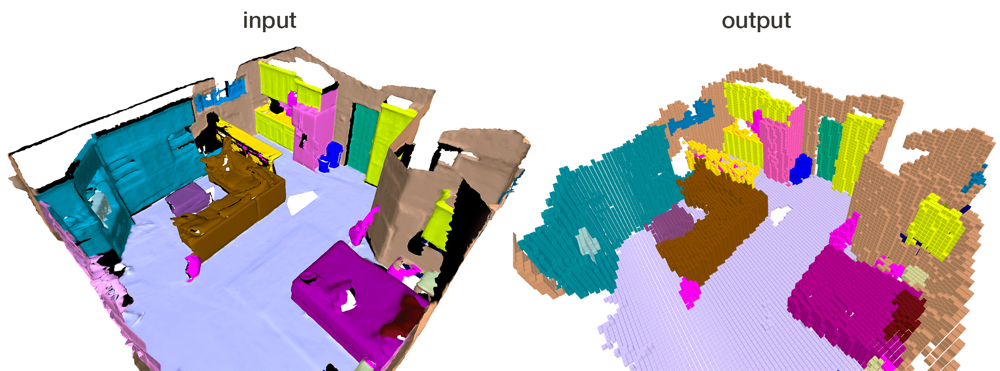

Classy Voxelizer
====
Voxelizes a mesh at a given voxel size using a face splitting algorithm. Classy Voxelizer can treat the colors of points as corresponding to classes and preserves these during voxelization. Or it can just treat them as colors to produce a colored voxelization.



### Build:
```
mkdir build && cd build
cmake -DCMAKE_BUILD_TYPE=Release ..
make
```

### Usage:

For point clouds in which colors represent classes:
`./classy_voxelizer <input> <output> <voxel_size> class`

For point clouds in which colors don't represent classes:
`./classy_voxelizer <input> <output> <voxel_size> color`

Classy Voxelizer is particularly useful to process [ScanNet](https://github.com/ScanNet/ScanNet) data

    @inproceedings{dai2017scannet,
        title={ScanNet: Richly-annotated 3D Reconstructions of Indoor Scenes},
        author={Dai, Angela and Chang, Angel X. and Savva, Manolis and Halber, Maciej and Funkhouser, Thomas and Nie{\ss}ner, Matthias},
        booktitle = {Proc. Computer Vision and Pattern Recognition (CVPR), IEEE},
        year = {2017}
    }

### Notes:
* Reads ASCII/binary PLY, writes binary PLY (thanks to [tinyply](https://github.com/ddiakopoulos/tinyply))
* <voxel_size> argument in meters
* Requires Eigen3

### License:
[BSD 2-Clause License](LICENSE)
